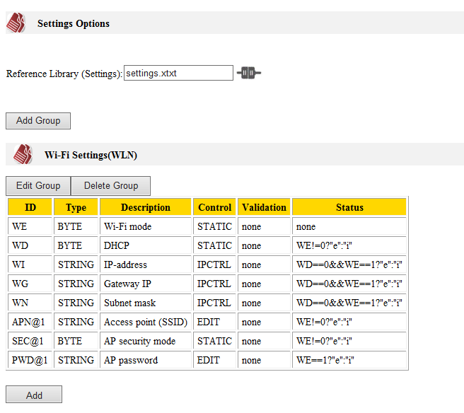
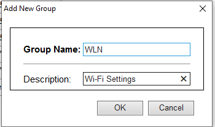
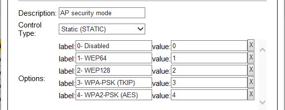

# LUIS (Loadable User Interface System)

The LUIS library utilizes the WA2000 module's Bluetooth capabilities to allow for users to edit settings via the LUIS mobile application. 


## Table of Contents

- [Library Info](#library-info)
- [Step-by-Step Usage Instructions](#step-by-step-usage-instructions)
  * [Step 1: Dependencies](#step-1:-dependencies)
  * [Step 2: Adding the LUIS Library](#step-2:-adding-the-luis-library)
  * [Step 3: Configuration](#step-3:-configuration)
    + [Configuration Group](#configuration-group)
    + [Adding a Configuration](#adding-a-configuration)
      - [Control Types](#control-types)
        * [Static Control](#static-control)
        * [Edit Control](#edit-control)
        * [IP Control](#ip-control)
        * [Ethernet Control](#ethernet-control)
      - [Validation](#validation)
      - [Status](#status)
  * [Step 4: Sample Code](#step-4:-sample-code)
- [Library Defines (Options)](#library-defines-(options))
  * [LUIS_DEBUG_PRINT](#luis_debug_print)
  * [LUIS_CONFIG_FILE](#luis_config_file)
  * [LUIS_BT_RX_BUF_SIZE](#luis_bt_rx_buf_size)
  * [LUIS_BT_TX_BUF_SIZE](#luis_bt_tx_buf_size)
  * [LUIS_BT_RST](#luis_bt_rst)
  * [LUIS_BT_CS](#luis_bt_cs)
  * [LUIS_BT_DI](#luis_bt_di)
  * [LUIS_BT_DO](#luis_bt_do)
  * [LUIS_BT_CLK](#luis_bt_clk)
- [En_luis_status_codes](#en-luis-status-codes)
- [Library Procedures](#library-procedures)
    + [Luis_start()](#luis-start())
    + [Luis_on_bt_data_arrival()](#luis-on-bt-data-arrival())
    + [Luis_on_bt_data_sent()](#luis-on-bt-data-sent())
    + [Luis_on_bt_event()](#luis-on-bt-event())
    + [Callback_luis_bt_connected()](#callback-luis-bt-connected())
    + [Callback_luis_bt_disconnected()](#callback-luis-bt-disconnected())
    + [Callback_luis_bt_enabled()](#callback-luis-bt-enabled())
    + [Callback_luis_bt_disabled()](#callback-luis-bt-disabled())
    + [Callback_luis_buzz_command()](#callback-luis-buzz-command())

## Library Info

|                        |                                                              |
| ---------------------- | ------------------------------------------------------------ |
| Supported platforms:   | Any platform with Bluetooth ([bt.](http://docs.tibbo.com/taiko/object_bt.htm)) interface. |
| Files to include:      | luis.tbs, luis.tbh, luis.html (from current_library_set\luis\trunk\) |
| Dependencies:          | [STG](<http://docs.tibbo.com/taiko/lib_stg.htm>) library     |
| API procedures:        | [luis_start()](#luis_start()) - Boots the WA2000, enables Bluetooth, and sets the advertised name of the device |
| Event procedures:      | [luis_on_bt_data_arrival()](#luis_on_bt_data_arrival()) - Call this from [on_bt_data_arrival()](<http://docs.tibbo.com/taiko/bt_on_bt_data_arrival.htm>) <br />[luis_on_bt_data_sent()](#luis_on_bt_data_sent()) - Call this from [on_bt_data_sent()](<http://docs.tibbo.com/taiko/bt_on_bt_data_sent.htm>)<br />[luis_on_bt_event()](#luis_on_bt_event()) - Call this from [on_bt_event()](<http://docs.tibbo.com/taiko/bt_on_bt_event.htm>) |
| Callback procedures:   | [callback_luis_bt_connected()](#callback_luis_bt_connected()) - A host device has connected via Bluetooth.<br />[callback_luis_bt_disconnected()](#callback_luis_bt_disconnected()) - A host device has disconnected.<br />[callback_luis_bt_enabled()](#callback_luis_bt_enabled()) - Bluetooth has been enabled successfully.<br />[callback_luis_bt_disabled()](#callback_luis_bt_disabled()) - Indicates that the Bluetooth has failed. Call [luis_start()](#luis_start()) to restart it.<br />[callback_luis_buzz_command()](#callback_luis_buzz_command()) - Indicates that the buzz ("B") command was received from the host. |
| Required buffer space: | 2 buffer pages minumum.<br />1 page for Bluetooth RX<br />1 page for Bluetooth TX |


## Step-by-Step Usage Instructions

### Step 1: Dependencies

1. Make sure you have the [STG](<http://docs.tibbo.com/taiko/lib_stg.htm>) library in your project
2. Add **include "settings\trunk\settings.tbh"** to the includes section of the global.tbh file
3. Create a settings file e.g. settings.xtxt. Include the settings file in **global.tbh** e.g. **includepp "settings.xtxt"**
4. add **settings_start()** to your **on_sys_init()**

### Step 2: Adding the LUIS Library

1. Add **luis.tbh**, **luis.tbs**, and **luis.html** to your project
2. Add **include "luis\trunk\luis.tbh"** to the includes section of the global.tbh file
3. Add **luis_start()** to your **on_sys_init()**

> **Note:** If you want to use the **wln** library, **luis_start()** should be called after**wln_start()**

4. Add [#define LUIS_DEBUG_PRINT 1](#Library-Defines-(Options)) to the defines section of the **global.tbh** file of your project. This way you will "see what's going on". Don't forget to remove this later, after you've made sure that the library operates as expected.

5. Create a new file with type of "LUIS Library" to your project. 

   Add [#define LUIS_CONFIG_FILE "filename.xtxt"](#Library-Defines-(Options)) to your **global.tbh** file of your project, with the name of the file you have just created.

4. Add LUIS event procedures to respective event handlers

```basic
sub on_bt_event(bt_event as enum pl_bt_events)
	luis_on_bt_event(bt_event)
end sub

sub on_bt_data_sent()
	luis_on_bt_data_sent()
end sub

sub on_bt_data_arrival()
	luis_on_bt_data_arrival()
end sub
```


5. Implement LUIS library callbacks

```basic
sub callback_luis_bt_connected()
end sub

sub callback_luis_bt_disconnected()
end sub

sub callback_luis_bt_enabled()
end sub

sub callback_luis_bt_disabled()
end sub

sub callback_luis_buzz_command()
end sub
```

### Step 3: Configuration

The LUIS configurator is a [JavaScript-based editor](http://docs.tibbo.com/taiko/lib_descr_files_configurators.htm) for the setting configuration file. Do not confuse the two. Setting descriptor file is a part of your project (it is a resource file). The editor is a "representer" — it provides a convenient interface for the editing of the configuration file. The configurator also masks the complexity of the underlying configuration file.

Every LUIS configuration file corresponds to a settings file. Start off by specifying the name of the settings file to link to in the field "Reference Library(Settings)". 



#### Configuration Group

Configurations can be placed in groups of similar functionality. You may give it an ID and a descriptive name (the name that is displayed in the LUIS app UI).



#### Adding a Configuration

Every configuration is linked to a setting. You may specify how that setting is displayed to user by specifying the type of input control it uses. 


##### Control Types

###### Static Control

This displays a dropdown in the UI. You can specify the displayed text for each option, and the actual value of the option.



###### Edit Control

This is an editable text box. You can specify validation of this field in the **Validation** section.

###### IP Control

This is an editable text box that only accepts valid IP address values.

###### Ethernet Control

This is an editable text box that accepts 6 byte mac address values in decimal form e.g. 0.1.2.3.4.56.

##### Validation

This is a C-like expression returning either an empty string "" for SUCCESS, or an error string (e.g. "Value is out of bounds") in case of an invalid value. The message should inform the user of the valid range of values.

Examples:

A setting named **SC** where valid values are from 0~250

```C
SC>=0&&SC<=250?"":"Valid values are from 0~250"
```

Validation rules can also be nested

```C
SC>=0?(SC<=250?"":"SC must be less than 250"):"SC must be greater than 0"
```


##### Status

The status property is a C-like expression that determines the state of the current UI control. The expression returns a single character(insensitive) that describes the final state of the control.

Possible states:

**e** - normal (enabled)

**i** - irrelevant (displayed as grayed &quot;(irrelevant)&quot;)

**f** - fixed (followed by value; cannot edit this setting)

**a** - auto-configured (displayed in red color; still can edit, but the user value may be overriden/ignored, e.g. IP when DHCP is ON)

**h** - hidden (only in the newest TDST -- still unpublished at the moment)

Examples: 

When **WE** is zero, enable this configuration, otherwise show as irrelevant.

```C
WE!=0?"e":"i"
```

Configuration depends on two settings.

Enables the control if **WD** is 0 and **WE** is 1

```C
WD==0&&WE==1?"e":"i"
```


### Step 4: Sample Code

A bare minimal project should look something like this:

**main.tbs**

```basic
sub on_sys_init()
	stg_start()
    luis_start("your_device_name")
end sub

'LUIS event handlers--------------------------------
sub on_bt_event(bt_event as enum pl_bt_events)
	luis_on_bt_event(bt_event)
end sub

sub on_bt_data_sent()
	luis_on_bt_data_sent()
end sub

sub on_bt_data_arrival()
	luis_on_bt_data_arrival()
end sub

'LUIS callbacks-------------------------------------
sub callback_luis_bt_connected()
end sub

sub callback_luis_bt_disconnected()
end sub

sub callback_luis_bt_enabled()
end sub

sub callback_luis_bt_disabled()
end sub

sub callback_luis_buzz_command()
end sub

'settings callbacks-------------------------------------
sub callback_stg_error(byref stg_name_or_num as string,index as byte,status as en_stg_status_codes)
end sub
sub callback_stg_pre_get(byref stg_name_or_num as string,index as byte,byref stg_value as string)
end sub
sub callback_stg_post_set(byref stg_name_or_num as string, index as byte,byref stg_value as string)
end sub
```

**global.tbh**

```basic
'DEFINES-------------------------------------------------------------
#define LUIS_CONFIG_FILE "luis.xtxt"
#define LUIS_DEBUG_PRINT 1

'INCLUDES------------------------------------------------------------
includepp "settings.xtxt"
include "settings\trunk\settings.tbh"
include "luis\trunk\luis.tbh"

```


## Library Defines (Options)

### LUIS_DEBUG_PRINT

default=0

 0- no debug information.

1- print debug information into the output pane. Debug printing only works when the project is in the [debug mode](http://docs.tibbo.com/taiko/tide_compiling.htm). However, still set this option to 0 for release, as this will save memory and code space.

### LUIS_CONFIG_FILE

File name of the LUIS configuration file in your project

### LUIS_BT_RX_BUF_SIZE

default=5

Size of Bluetooth RX Buffer (in pages)

### LUIS_BT_TX_BUF_SIZE

default=5

Size of Bluetooth TX Buffer (in pages)

### LUIS_BT_RST

default=PL_IO_NUM_51

RST line mapping

### LUIS_BT_CS

default=PL_IO_NUM_49

CS line mapping

### LUIS_BT_DI

default=PL_IO_NUM_52

DI line mapping

### LUIS_BT_DO

default=PL_IO_NUM_50

DO line mapping

### LUIS_BT_CLK

default=PL_IO_NUM_53

CLK line mapping

## En_luis_status_codes

| Value | Enum                       | Description                                          |
| ----- | -------------------------- | ---------------------------------------------------- |
| 0     | EN_LUIS_STATUS_OK          | Operation completed successfully                     |
| 1     | EN_LUIS_STATUS_NOT_STARTED | luis_start() was not called or failed                |
| 2     | EN_LUIS_BT_FAILURE         | Bluetooth interface failure                          |
| 3     | EN_LUIS_FILE_HTML_ERROR    | Failed to open luis.html file                        |
| 4     | EN_LUIS_FILE_CONFIG_ERROR  | Failed to open <LUIS_CONFIG_FILE> configuration file |

## Library Procedures

#### Luis_start()

|              |                                                              |
| ------------ | ------------------------------------------------------------ |
| Description: | Boots the WA2000, enables Bluetooth, and sets the advertised name of the device |
| Syntax:      | function luis_start(byref bt_name as string) as en_luis_status_codes |
| Returns:     | One of these [en_luis_status_codes](#en_luis_status_codes): EN_LUIS_STATUS_OK, EN_LUIS_BT_FAILURE, EN_LUIS_FILE_HTML_ERROR, EN_LUIS_FILE_CONFIG_ERROR |
| See Also:    | [Step-by-Step Usage Instructions](#Step-by-Step-Usage-Instructions) |


| Part    | Description                                        |
| ------- | -------------------------------------------------- |
| bt_name | The name of the device to advertise over Bluetooth |


#### Luis_on_bt_data_arrival()

|              |                                                              |
| ------------ | ------------------------------------------------------------ |
| Description: | Call this from **on_bt_data_arrival()**                      |
| Syntax:      | function luis_on_bt_data_arrival() as en_luis_status_codes   |
| Returns:     | status code of processing Bluetooth received data            |
| See Also:    | [Step-by-Step Usage Instructions](#Step-by-Step-Usage-Instructions) |


#### Luis_on_bt_data_sent()

|              |                                                              |
| ------------ | ------------------------------------------------------------ |
| Description: | Call this from **on_bt_data_sent()**. This function is responsible for sending the html file to the LUIS mobile app. It calls **romfile.open**. If you are using the romfile object while the LUIS library is sending the file, make sure you restore the opened file and the pointer after the LUIS library has sent over the file. |
| Syntax:      | sub luis_on_bt_data_sent()                                   |
| Returns:     |                                                              |
| See Also:    | [Step-by-Step Usage Instructions](#Step-by-Step-Usage-Instructions) |

#### Luis_on_bt_event()

|              |                                                              |
| ------------ | ------------------------------------------------------------ |
| Description: | Call this from **on_bt_event()**                             |
| Syntax:      | sub luis_on_bt_event(bt_event as enum pl_bt_events)          |
| Return:      |                                                              |
| See Also:    | [Step-by-Step Usage Instructions](#Step-by-Step-Usage-Instructions) |


| Part     | Description                                                  |
| -------- | ------------------------------------------------------------ |
| bt_event | The Bluetooth event received in **on_bt_event()** e.g. connected, disconnected, disabled, enabled |


#### Callback_luis_bt_connected()

|              |                                                              |
| ------------ | ------------------------------------------------------------ |
| Description: | Callback procedure, a host device has connected via Bluetooth. Procedure body has to be created elsewhere in the project (externally with respect to the library). |
| Syntax:      | sub callback_luis_bt_connected()                             |
| Return:      |                                                              |
| See Also:    | [Step-by-Step Usage Instructions](#Step-by-Step-Usage-Instructions) |

#### Callback_luis_bt_disconnected()

|              |                                                              |
| ------------ | ------------------------------------------------------------ |
| Description: | Callback procedure, a host device has disconnected. Procedure body has to be created elsewhere in the project (externally with respect to the library). |
| Syntax:      | sub callback_luis_bt_disconnected()                          |
| Return:      |                                                              |
| See Also:    | [Step-by-Step Usage Instructions](#Step-by-Step-Usage-Instructions) |

#### Callback_luis_bt_enabled()

|              |                                                              |
| ------------ | ------------------------------------------------------------ |
| Description: | Callback procedure, Bluetooth has been enabled successfully. Procedure body has to be created elsewhere in the project (externally with respect to the library). |
| Syntax:      | sub callback_luis_bt_enabled()                               |
| Return:      |                                                              |
| See Also:    | [Step-by-Step Usage Instructions](#Step-by-Step-Usage-Instructions) |

#### Callback_luis_bt_disabled()

|              |                                                              |
| ------------ | ------------------------------------------------------------ |
| Description: | Callback procedure, indicates that the Bluetooth has failed. Call luis_start() to restart it. Procedure body has to be created elsewhere in the project (externally with respect to the library). |
| Syntax:      | sub callback_luis_bt_disabled()                              |
| Return:      |                                                              |
| See Also:    | [Step-by-Step Usage Instructions](#Step-by-Step-Usage-Instructions) |

#### Callback_luis_buzz_command()

|              |                                                              |
| ------------ | ------------------------------------------------------------ |
| Description: | Callback procedure, indicates that the buzz ("B") command was received from the host. Call luis_start() to restart it. Procedure body has to be created elsewhere in the project (externally with respect to the library). |
| Syntax:      | sub callback_luis_buzz_command()                             |
| Return:      |                                                              |
| See Also:    | [Step-by-Step Usage Instructions](#Step-by-Step-Usage-Instructions) |

